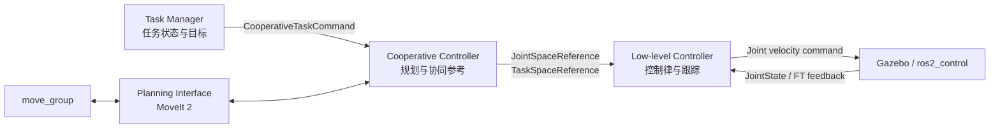

# ABB YuMi ROS 2 双臂协同控制项目

<p align="center">
  <strong>面向 ABB YuMi 的 ROS 2、Gazebo、MoveIt 2 双臂规划与分层控制系统</strong>
</p>

<p align="center">
  
  
  
  
  
</p>

本项目提供 ABB YuMi 双臂机器人的模型、Gazebo 仿真、MoveIt 2 规划、自定义 ROS 2 接口，以及“任务管理—协同控制—底层控制”的分层控制链路。当前主要用于双臂自由空间规划、关节速度跟踪和约束空间协同控制实验。

> [!IMPORTANT]
> 这是研究与实验性质的工程，尚未针对真实机器人部署完成安全验证。请先在仿真环境中验证参数、轨迹和控制逻辑。

## 功能概览

- YuMi 双臂及夹爪 URDF、碰撞模型和可视化模型
- Gazebo trajectory / velocity 两种仿真控制模式
- MoveIt 2 单臂、双臂规划与规划场景障碍物
- 面向上层调用的 ROS 2 Action 规划接口
- 自由空间与约束空间任务序列
- 关节空间、任务空间统一参考消息
- 基于 Pinocchio 的运动学、Jacobian 和底层速度控制
- 一条命令启动 velocity 完整控制栈

## 系统架构



各层职责：

| 层级 | ROS 2 包 | 职责 |
| --- | --- | --- |
| 任务层 | `yumi_task_manager` | 管理任务状态、控制模式和步骤切换 |
| 协同层 | `yumi_cooperative_controller` | 请求规划并生成关节空间或任务空间参考 |
| 规划层 | `yumi_planning_interface` | 封装 MoveIt 2 API，提供规划 Action |
| 控制层 | `yumi_low_level_controllers` | 将参考转换为底层关节控制命令 |
| 仿真层 | `yumi_simulation_interfaces` | 启动 Gazebo、ros2_control 和控制器 |

## 仓库结构

```text
.
├── docs/                              # 架构设计与开发资料
└── src/
    ├── yumi_description/              # URDF、mesh 与 RViz 显示
    ├── yumi_interfaces/               # 自定义 msg / action
    ├── yumi_simulation_interfaces/    # Gazebo 与 ros2_control
    ├── yumi_moveit_config/            # MoveIt 2 配置
    ├── yumi_planning_interface/       # 上层规划接口
    ├── yumi_cooperative_controller/   # 双臂协同控制层
    ├── yumi_low_level_controllers/    # 底层控制器
    └── yumi_task_manager/             # 任务状态机与完整启动入口
```

## 环境与依赖

### 已验证环境

| 组件 | 版本 |
| --- | --- |
| 操作系统 | Ubuntu 20.04 LTS |
| ROS 2 | Foxy Fitzroy |
| 仿真 | Gazebo Classic |
| 规划框架 | MoveIt 2 |

> [!NOTE]
> 本项目以 **Ubuntu 20.04 + ROS 2 Foxy** 为目标运行环境。其他 Ubuntu 或 ROS 2 版本尚未经过验证，可能需要调整依赖、Launch API 或 ros2_control 配置。

主要依赖：

- ROS 2 Foxy
- Gazebo Classic 与 `gazebo_ros_pkgs`
- `ros2_control`、`ros2_controllers` 和 `gazebo_ros2_control`
- MoveIt 2 与 OMPL
- Pinocchio
- Eigen 3
- `colcon` 与 `rosdep`

建议先安装对应 ROS 2 发行版的桌面环境、MoveIt 2、Gazebo ROS 和 ros2_control，再使用 `rosdep` 补齐包依赖。

## 构建

将仓库放入 ROS 2 工作空间后执行：

```bash
cd <your_ros2_workspace>
rosdep install --from-paths src --ignore-src -r -y
colcon build --symlink-install
source install/setup.bash
```

每次打开新终端，都需要先加载 ROS 2 和工作空间环境：

```bash
source /opt/ros/foxy/setup.bash
source <your_ros2_workspace>/install/setup.bash
```

### 仿真 URDF 路径配置

以下两份仿真 URDF 的 mesh 路径保留为经过验证的绝对路径：

- `src/yumi_simulation_interfaces/urdf/yumi_gazebo_ros2.urdf`
- `src/yumi_simulation_interfaces/urdf/yumi_gazebo_ros2_velocity.urdf`

如果你的工作空间不是 `/home/zhangjianglong/yumi_ws`，请在运行前将文件中的：

```text
file:///home/zhangjianglong/yumi_ws/src/yumi_description/
```

替换为本机 `yumi_description` 包源码目录对应的绝对 URI。URI 需要以 `file:///` 开头。

## 快速开始

### 1. 仅查看机器人模型

```bash
ros2 launch yumi_description display.launch.py
```

### 2. Gazebo 关节轨迹控制

```bash
ros2 launch yumi_simulation_interfaces sim_bringup_traj.launch.py
```

### 3. Gazebo 关节速度控制

```bash
ros2 launch yumi_simulation_interfaces sim_bringup_velocity.launch.py
```

无图形界面运行：

```bash
ros2 launch yumi_simulation_interfaces sim_bringup_velocity.launch.py gui:=false
```

### 4. MoveIt 2 仿真演示

```bash
ros2 launch yumi_moveit_config demo_sim.launch.py
```

### 5. 启动完整 velocity 控制栈

推荐通过统一入口启动 Gazebo、MoveIt、规划接口、任务管理器、协同控制器和底层控制器：

```bash
ros2 launch yumi_task_manager velocity_full_stack_bringup.launch.py
```

完整控制栈采用分阶段延时启动。首次启动时，等待约 45 秒后任务管理器才会进入默认任务序列，这是预期行为。

常用参数示例：

```bash
ros2 launch yumi_task_manager velocity_full_stack_bringup.launch.py \
  gui:=false \
  add_planning_scene_obstacles:=true \
  task_manager_delay:=45.0
```

## 主要接口

### Topic

| 接口 | 方向 | 说明 |
| --- | --- | --- |
| `/cooperative_task_command` | Task Manager → Cooperative Controller | 当前任务状态、模式和目标 |
| `/joint_space_reference` | Cooperative Controller → Low-level Controller | 关节空间参考 |
| `/task_space_reference` | Cooperative Controller → Low-level Controller | 双臂任务空间参考 |
| `/cooperative_controller_status` | Cooperative Controller → Task Manager | 协同层就绪状态 |
| `/low_level_controller_status` | Low-level Controller → Task Manager | 跟踪状态和到位反馈 |
| `/joint_states` | Gazebo → 控制与规划节点 | 当前关节状态 |

### Action

规划接口通过 `yumi_interfaces` 提供：

- `PlanArmPose`
- `PlanBothArmsPoses`
- `PlanTaskSpaceTrajectory`
- `ResetToHome`
- `ResetBothArmsToHome`
- `RunRandomMotion`

接口字段详见 [`src/yumi_interfaces`](src/yumi_interfaces/README.md)。

## 配置入口

| 文件 | 用途 |
| --- | --- |
| [`task_manager_skeleton.yaml`](src/yumi_task_manager/config/task_manager_skeleton.yaml) | 任务模式、目标位姿与步骤序列 |
| [`cooperative_velocity.yaml`](src/yumi_cooperative_controller/config/cooperative_velocity.yaml) | 协同控制周期与规划行为 |
| [`low_level_velocity.yaml`](src/yumi_low_level_controllers/config/low_level_velocity.yaml) | 控制增益、速度限制与任务空间参数 |
| [`ros2_controllers_velocity.yaml`](src/yumi_simulation_interfaces/config/ros2_controllers_velocity.yaml) | Gazebo 速度控制器 |
| [`planning_scene_obstacles.yaml`](src/yumi_planning_interface/config/planning_scene_obstacles.yaml) | MoveIt 规划场景障碍物 |

## 文档

- [系统架构设计](docs/hybrid_controller_design.md)
- [MoveIt API 开发笔记](docs/moveit_api_notes.md)
- [任务管理器代码导读](src/yumi_task_manager/docs/codewalkthrough.md)
- 各 ROS 2 包目录下的 `README.md`

## 当前限制

- 任务空间底层跟踪仍处于实验阶段，需要继续调整 Jacobian、增益和奇异点处理。
- 力/力矩反馈和混合力位控制接口已预留，但尚未完成系统级验证。
- 完整控制栈依赖启动延时完成节点间握手，后续可改为生命周期或显式服务机制。
- 仿真 URDF 当前依赖本机绝对 mesh URI，使用前必须按工作空间位置调整。
- 当前未提供真实 YuMi 硬件驱动和安全控制链路。

## 贡献

欢迎通过 Issue 报告复现步骤明确的问题，或通过 Pull Request 提交改进。修改消息和 Action 后，请先单独构建 `yumi_interfaces`，再构建依赖包。

## 许可证

各 ROS 2 包的 `package.xml` 声明为 Apache-2.0。正式公开仓库前，请在根目录补充对应的 `LICENSE` 文件。
